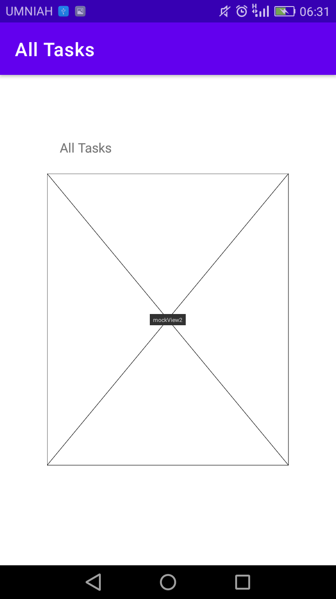

# taskmaster
## Lab 26 "Introduction to Android Development-> activity"
- in this lab there is three activities:
   - main activity
   - All Tasks activity
   - Add Task activity   
following a screenshots for the three pages:   
   
   
   
- in the main activity you can navigate to All Tasks activity, and you can navigate to Add Task activity, also there is placeholder for showing my tasks
- in Add Task as you can see you can add title for task, and the detail, after that pressing the bottum 'Add Task', until now there is no functionality on this bottum
- in the all task page there is a placeholder for tasks, and in the same page i will do a functionality to counter the number of tasks   
***
## Lab 27 "Introduction to Android Development-> using shared prefrences"
- in this lab i added three pages:
   - setting
   - task detail
   - refacotred home page
### setting
   
- as you can see you can add your username and hit save button=> it will saved in shared prefrence, then when you go to home page you will see your username at the top of the page
### new home page
   
- as you can see we shown the username, and there is a button for every task for the user, and when he hit one of them=> we will redirect him to deatail page and he will see at the top the task that saved in shared prefrence   
### task detail   
   
***
## Lab 28 "using Rescycler View for rendering lists"
- in this lab i added two pages:
   - task detail
   - refacotred home page
- added new class called Task which is have three properties:
   - title
   - body
   - state
- the tasks title hardcoded addition was implement
- for the list i use Recycler view
### new home page
   
- in this page you will see the Recyler View lists
- when you hit on one of them you will see a message till you that you will go to the detail for this task
### new task detail   
   
- you see here the title of the task and the detail for it "lorem ipsem"
- the title was stored in shared prefrence
## Lab 29 "Use Room local database"
- in this lab i added five features to my app:
   - make my task class as an entity for the table in database called task
   - adding form in adding task acivity in order to save in database
   - rendering the tasks in the main activity using recycyler view
   - when you hit in any task you will go to task detail
   - in task detail you will see your task title, decription and it's state    
   
 
 

- in the comming labs we will use another type of databases